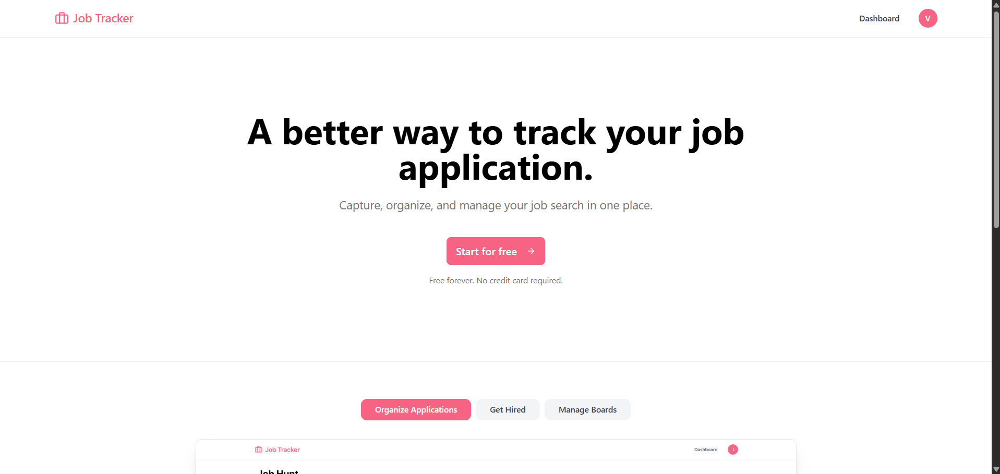
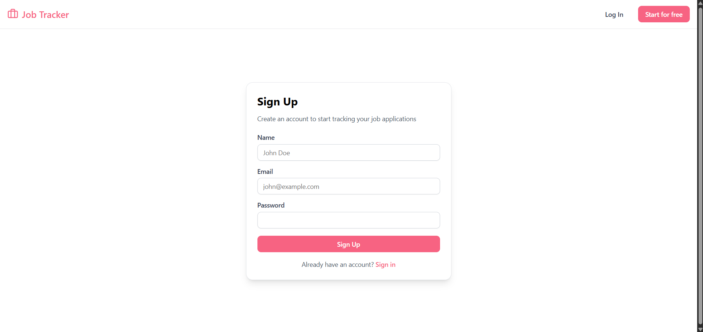
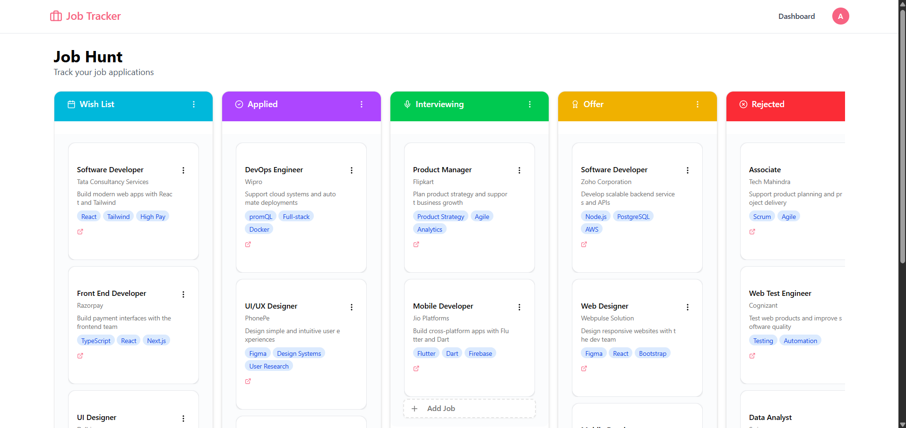
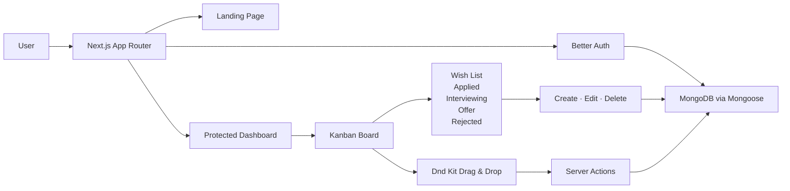

# 📋 Job Application Tracker — Full-Stack Kanban Job Tracking Platform


Job Application Tracker is a full-stack Kanban-based job application management platform built with Next.js, TypeScript, MongoDB, and Better Auth.

It enables job seekers to organize, monitor, and manage every stage of their application journey through a responsive Kanban dashboard featuring secure authentication, drag-and-drop workflows, and persistent database storage.

- Built secure authentication and protected user dashboards using Better Auth
- Developed a responsive Kanban board with drag-and-drop job management using Dnd Kit
- Implemented complete CRUD operations for job applications with MongoDB and Mongoose
- Designed a clean and responsive interface using Tailwind CSS and shadcn/ui components

------------------------------------------------------------------------

## 🌐 Live Demo

🔗 https://aarsh-job-tracker.vercel.app/

------------------------------------------------------------------------

## ✨ Why This Project Stands Out

- Full-stack Kanban job application tracker built with the Next.js App Router
- Secure MongoDB-backed authentication with protected user-specific dashboards
- Drag-and-drop Kanban workflow for managing every stage of the hiring process
- Complete CRUD functionality for job applications with persistent database storage
- Responsive interface designed using Tailwind CSS and shadcn/ui
- Clean architecture using Server Components, Client Components, Server Actions, and MongoDB

------------------------------------------------------------------------

## 📸 Screenshots

### 🏠 Landing Page

<p align="center">
  
</p>

> A modern landing page introducing the platform with authentication, responsive navigation, and a clear call-to-action for organizing job applications.

---

### 🔐 User Authentication

<p align="center">
  
</p>

> Secure user registration powered by Better Auth with MongoDB-backed authentication and protected user sessions.

---

### 📋 Kanban Job Dashboard

<p align="center">
  
</p>

> Organize job applications across customizable hiring stages using an interactive drag-and-drop Kanban board with persistent database updates.

------------------------------------------------------------------------

## 🧠 Core Features

### 🔐 Authentication & User Management

- Secure email and password authentication using Better Auth
- MongoDB-backed user accounts and authenticated sessions
- Protected application routes with automatic authentication redirects
- Automatic board initialization for every newly registered user
- Persistent user sessions using secure cookies
- User-specific dashboards and isolated job application data

### 📋 Interactive Kanban Board

- Five default hiring stages:
  - Wish List
  - Applied
  - Interviewing
  - Offer
  - Rejected
- Responsive Kanban interface for managing job applications
- Smooth drag-and-drop interactions powered by Dnd Kit
- Automatic database updates after moving applications
- Persistent ordering of jobs within each column
- Visual hiring pipeline for tracking application progress

### 💼 Job Application Management

- Create new job applications
- Edit existing applications
- Delete applications
- Move applications across hiring stages
- Store detailed job information including:
  - Company
  - Position
  - Location
  - Salary
  - Job URL
  - Description
  - Personal Notes
  - Technology Tags
- External job links for quick access to original postings

### 🎯 Responsive User Experience

- Fully responsive interface for desktop and mobile devices
- Modern UI built using shadcn/ui components
- Dialog-based job creation and editing workflow
- Dropdown menus for quick application management
- Interactive cards with clean Kanban organization
- Smooth drag-and-drop experience with visual feedback

------------------------------------------------------------------------

## 🛠️ Tech Stack

| Category | Technologies |
| --- | --- |
| **Frontend** | Next.js 16 · React 19 · TypeScript · Tailwind CSS 4 |
| **UI & Components** | shadcn/ui · Radix UI · Lucide React |
| **Authentication** | Better Auth · MongoDB Adapter |
| **Database** | MongoDB · Mongoose |
| **Drag & Drop** | Dnd Kit |
| **Utilities** | Server Actions · React Hooks · TypeScript |
| **Deployment** | Vercel |

------------------------------------------------------------------------

## 🏗️ Architecture Overview



------------------------------------------------------------------------

## ⚡ Challenges & Learnings

- Integrated Better Auth with MongoDB and protected Next.js App Router layouts
- Managed authentication state across Server and Client Components
- Designed a responsive Kanban interface using Dnd Kit drag-and-drop interactions
- Built reusable dialog, dropdown, and form components with shadcn/ui
- Implemented persistent job ordering and column updates using MongoDB
- Resolved hydration issues, nested Radix component conflicts, drag-and-drop behavior, and deployment configuration challenges

------------------------------------------------------------------------

## 🚧 Future Improvements

- Support custom Kanban columns with drag-and-drop column reordering
- Add search, filtering, and advanced sorting for job applications
- Implement reminders for interview schedules and follow-ups
- Add file uploads for resumes, cover letters, and interview documents
- Introduce analytics dashboards to visualize job search progress
- Add calendar integration and interview scheduling
- Implement email notifications and application reminders
- Add automated testing for authentication, server actions, and drag-and-drop functionality

------------------------------------------------------------------------

## 📦 Project Structure

```text
Job-Application-Tracker/
├── app/
│   ├── (auth)/
│   │   ├── sign-in/
│   │   └── sign-up/
│   │
│   ├── dashboard/
│   │
│   ├── api/
│   │   └── auth/
│   │
│   ├── layout.tsx
│   ├── page.tsx
│   └── globals.css
│
├── components/
│   ├── ui/
│   ├── navbar.tsx
│   ├── kanban-board.tsx
│   ├── job-application-card.tsx
│   ├── create-job-dialog.tsx
│   ├── edit-job-dialog.tsx
│   ├── sign-out-btn.tsx
│   └── ...
│
├── lib/
│   ├── actions/
│   ├── auth/
│   ├── hooks/
│   ├── models/
│   ├── schemas/
│   ├── db.ts
│   ├── init-user-board.ts
│   └── utils.ts
│
├── public/
│   └── screenshots/
│       ├── landing.png
│       ├── signup.png
│       └── dashboard.png
│
├── next.config.ts
├── package.json
├── tsconfig.json
└── README.md
```

------------------------------------------------------------------------

## 👔 Recruiter Snapshot

- Built and deployed a full-stack Kanban job application tracker using Next.js, React, TypeScript, MongoDB, and Better Auth
- Implemented secure authentication, protected routes, and automatic user board initialization
- Developed a responsive drag-and-drop Kanban board using Dnd Kit with persistent database synchronization
- Built complete CRUD functionality for job applications using MongoDB, Mongoose, and Server Actions
- Designed reusable UI components with Tailwind CSS and shadcn/ui for a modern, responsive user experience
- Successfully deployed the production application on Vercel with MongoDB-backed authentication and persistent database integration
